# LiPo Battery Tester

A LiPo battery tester designed to measure and evaluate 1S, 2S, and 3S LiPo batteries.

The tester measures individual cell voltages and PACK voltage using an external TLA2528 ADC controlled by a Cytron Maker UNO. The measured values are displayed on a 16x2 I2C LCD, with PASS/FAIL indication using an LED and buzzer.

---

# Project Overview

This project was developed as a standalone LiPo Battery Tester.

The system is designed to test:

- 1S LiPo batteries
- 2S LiPo batteries
- 3S LiPo batteries

The tester measures the voltage of each individual cell and also measures the total PACK voltage.

The final result is determined from both the individual cell measurements and the PACK measurement.

If all required cells pass and the PACK voltage passes, the final result is:

`PASS`

If any cell fails or the PACK voltage fails, the final result is:

`FAIL`

---

# Features

- 1S LiPo battery testing
- 2S LiPo battery testing
- 3S LiPo battery testing
- Individual cell voltage measurement
- PACK voltage measurement
- External TLA2528 ADC
- 12-bit ADC measurement
- Voltage divider circuits
- Calibration for voltage measurements
- 16x2 I2C LCD
- Battery type selection
- PASS/FAIL indication
- LED status indication
- Buzzer indication
- Battery removal detection
- Short press control
- Long press control
- Dedicated ON/OFF power switch
- Regulated 5V supply for the Maker UNO
- Separate 3.3V supply for the TLA2528 ADC
- Compact assembled enclosure
- Physical mounting board for the complete tester

---

# Hardware Components

The main hardware components used in the project include:

- Cytron Maker UNO
- TLA2528 external ADC
- 16x2 I2C LCD
- DC-DC voltage regulator
- LED and push button module
- Buzzer
- ON/OFF power switch
- 1S LiPo battery connector
- 2S LiPo battery connector
- 3S LiPo battery connector
- Separate PACK connector
- Voltage divider resistors
- LiPo batteries for testing
- Mounting board
- 3D-printed LCD enclosure
- Connection wires and connectors

---

# Complete Hardware Assembly

The complete tester was assembled on a mounting board.

The main assembly includes the Maker UNO, TLA2528 ADC, voltage regulator, LCD enclosure, power switch, battery connectors, PACK connector, LED/button module, and wiring.

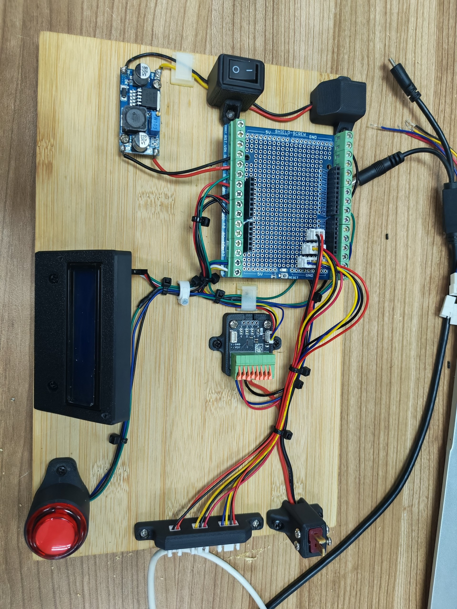

**Figure 1.** Complete hardware assembly of the LiPo Battery Tester.

---

# Cytron Maker UNO

The Cytron Maker UNO is used as the main controller of the tester.

It controls the LCD, push button, LED, buzzer, and communicates with the TLA2528 ADC through the I2C interface.

The Maker UNO is powered from a regulated 5V supply.

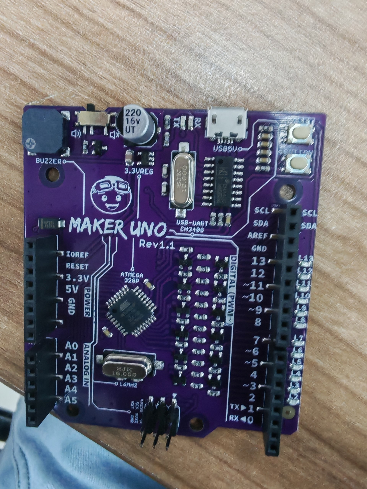

---

# Power Supply

The tester uses an external DC power input.

A DC-DC voltage regulator is used to provide the required supply voltage.

The regulator output was adjusted and verified at:

`5V`

The regulated 5V supply is used to power the Maker UNO.

The TLA2528 ADC is powered separately from:

`3.3V`

A dedicated ON/OFF power switch is included in the main power circuit.

---

# TLA2528 ADC

The TLA2528 is used as the external ADC for measuring the battery voltages.

The ADC communicates with the Maker UNO using the I2C interface.

The TLA2528 is powered from:

`3.3V`

The ADC is configured to measure the voltage divider outputs connected to its analog input channels.

The TLA2528 I2C address used in this project is:

`0x10`

---

# LCD Display

A 16x2 I2C LCD is used to display the tester status, battery selection, measured cell voltages, PACK voltage, and final result.

The LCD I2C address used in this project is:

`0x27`

The LCD displays different screens depending on the current tester state.

---

# LED and Push Button

A combined LED and push button module is used for user control and status indication.

The module has three connections:

- LED signal
- Button signal
- Common GND

The connections used in the project are:

| Function | Maker UNO Pin |
|---|---|
| LED | D4 |
| Button | D7 |
| Buzzer | D8 |

The LED indicates the test result.

The button is used to select the battery type, start a test, and return to the previous screen using short and long presses.

---

# Battery Connectors

The tester supports 1S, 2S, and 3S LiPo batteries.

The battery connector wiring was combined into a common four-wire arrangement.

The final wire arrangement is:

| Wire | Function |
|---|---|
| Black | GND / B- |
| Red | S1 cumulative voltage |
| Blue | S2 cumulative voltage |
| Green | S3 cumulative voltage / PACK+ |

For a 3S battery, the measured cumulative voltages are used to calculate the individual cell voltages.

For example:

`Cell 1 = S1`

`Cell 2 = S2 - S1`

`Cell 3 = S3 - S2`

---

# PACK Connector

A separate two-wire PACK connector is also included in the tester.

The PACK connector is used to measure the total battery voltage independently.

The connections are:

| PACK Connector | Function |
|---|---|
| PACK+ | Connected to CH3 voltage divider |
| PACK- | GND |

The PACK voltage measurement is used as an additional check of the battery's total voltage.

---

# Voltage Divider Circuit

Voltage divider circuits are used to reduce the battery voltage to a safe measurement range for the TLA2528 ADC.

The divider values used in the project are:

| Channel | R1 | R2 | Divider Multiplier |
|---|---:|---:|---:|
| CH0 | 10kΩ | 10kΩ | 2.000000 |
| CH1 | 20kΩ | 10kΩ | 3.000000 |
| CH2 | 15kΩ | 3.9kΩ | 4.846154 |
| CH3 | 15kΩ | 3.9kΩ | 4.846154 |

The divider multiplier is calculated using:

`Multiplier = (R1 + R2) / R2`

For CH2 and CH3:

`(15kΩ + 3.9kΩ) / 3.9kΩ = 4.846154`

---

# ADC Channels

The TLA2528 channels are used as follows:

| ADC Channel | Measurement |
|---|---|
| CH0 | S1 cumulative voltage |
| CH1 | S1 + S2 cumulative voltage |
| CH2 | S1 + S2 + S3 cumulative voltage |
| CH3 | PACK voltage |

The individual cell voltages are calculated from the cumulative measurements.

---

# Cell Voltage Calculation

For a 1S battery:

`Cell 1 = CH0`

For a 2S battery:

`Cell 1 = CH0`

`Cell 2 = CH1 - CH0`

For a 3S battery:

`Cell 1 = CH0`

`Cell 2 = CH1 - CH0`

`Cell 3 = CH2 - CH1`

The PACK voltage is measured separately through CH3.

---

# ADC Calibration

Calibration factors are included in the software to improve the voltage measurement accuracy.

The calibration values used are:

| Channel | Calibration |
|---|---:|
| CH0 | 0.98875 |
| CH1 | 1.00316 |
| CH2 | 1.00988 |
| CH3 | 1.00988 |

These values are applied to the measured ADC voltage before calculating the actual battery voltage.

---

# Battery Selection

When the tester is started, the battery selection screen allows the user to select:

`1S`

`2S`

`3S`

The selected battery type remains visible while the selection indicator blinks.

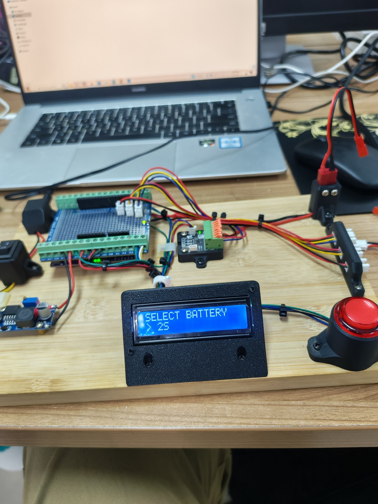

**Figure 2.** Battery type selection screen.

A short button press cycles through the available battery types.

A long button press confirms the selected battery type.

---

# Ready Screen

After selecting the battery type, the tester displays the ready screen.

For example:

`3S LiPo Tester`

`Press to test >>`

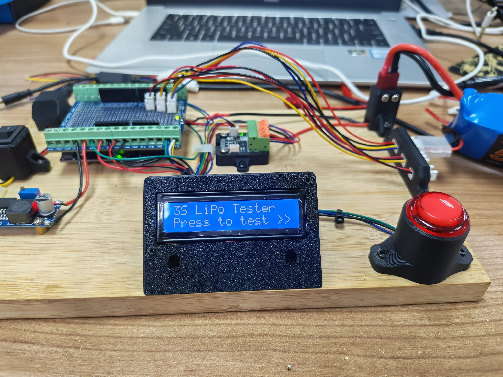

**Figure 3.** Ready screen before starting a 3S battery test.

A short button press starts the battery test.

A long button press returns to the battery selection screen.

---

# Testing Process

The testing process is:

1. Turn ON the tester.
2. Select the battery type.
3. Confirm the battery type using a long button press.
4. The tester displays the ready screen.
5. Connect the LiPo battery.
6. Press the button to start the test.
7. The TLA2528 measures the battery voltage channels.
8. The software calculates the individual cell voltages.
9. The PACK voltage is measured.
10. Each cell is checked against the defined limits.
11. The PACK voltage is checked.
12. The final PASS or FAIL result is displayed.
13. The result remains on the LCD while the battery is connected.
14. When the battery is removed, the tester returns to the ready screen.

---

# PASS / FAIL Logic

The final result depends on both the individual cells and the PACK voltage.

The battery passes only when:

- All required cells pass
- PACK voltage passes

If any individual cell fails, the final result is:

`FAIL`

If the PACK voltage fails, the final result is:

`FAIL`

Only when all required measurements pass is the final result:

`PASS`

---

# PASS Indication

When the battery passes:

- The LED remains ON.
- The buzzer beeps once.
- The LCD displays `[PASS]`.

Example 3S result:

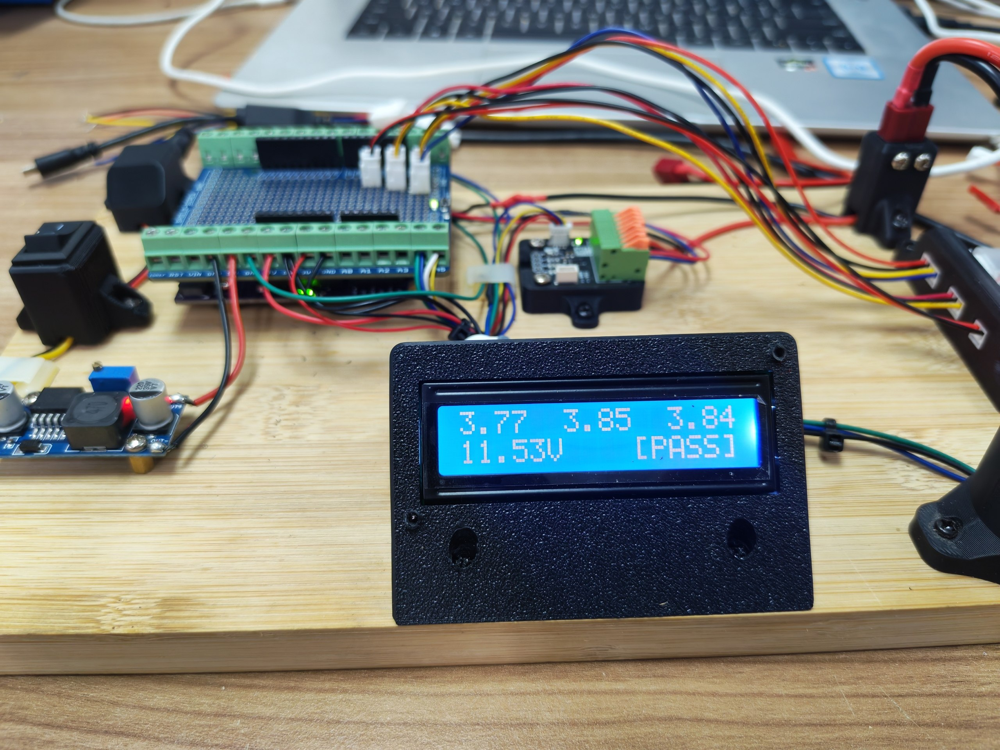

**Figure 4.** Example of a successful 3S LiPo battery test.

Example 2S result:

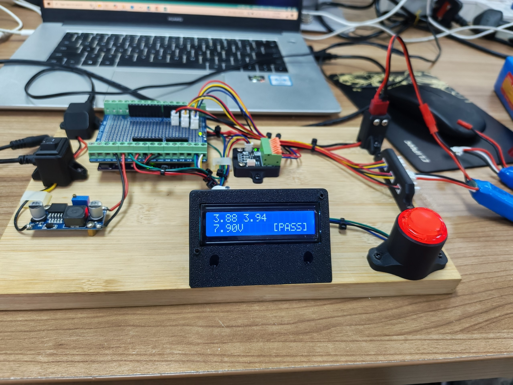

**Figure 5.** Example of a successful 2S LiPo battery test.

Another 2S PASS result:

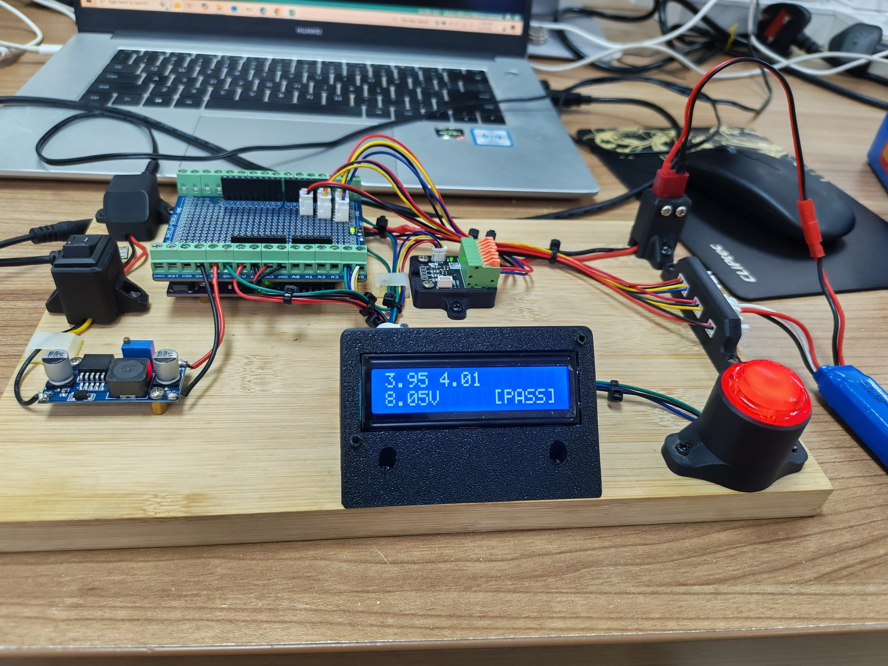

**Figure 6.** Another 2S PASS measurement.

---

# FAIL Indication

When the battery fails:

- The LED blinks continuously.
- The buzzer sounds three times.
- The LCD displays `[FAIL]`.

A battery can fail if one of the cells is outside the acceptable voltage range or if the PACK voltage does not pass.

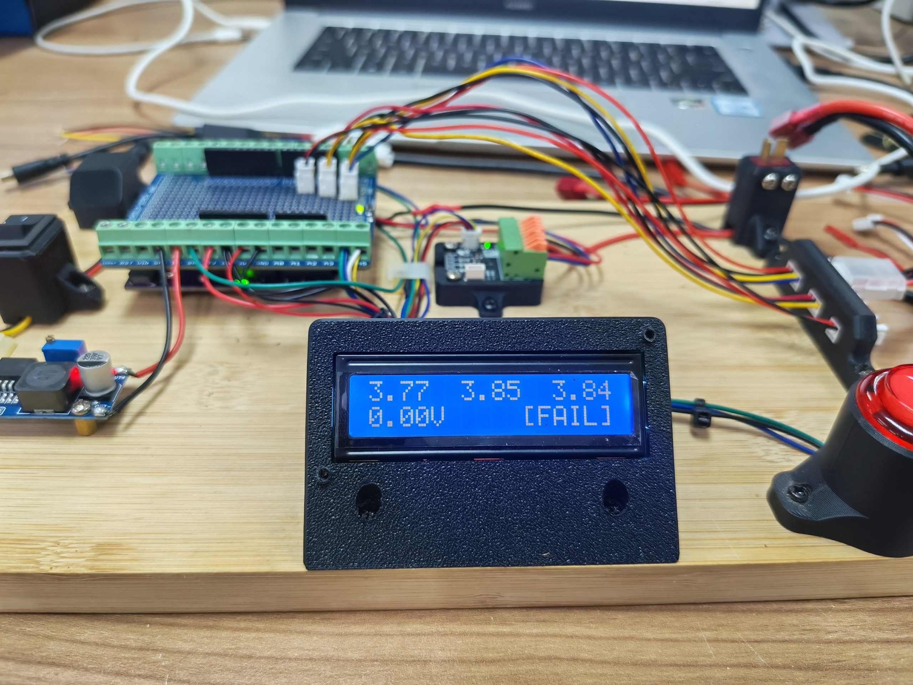

**Figure 7.** Example of a 3S battery test with a PACK-related failure.

---

# CHG Result

The tester can also display a `CHG` status during the testing process when the measured battery condition is not accepted as a normal PASS result.

Example 2S CHG screen:

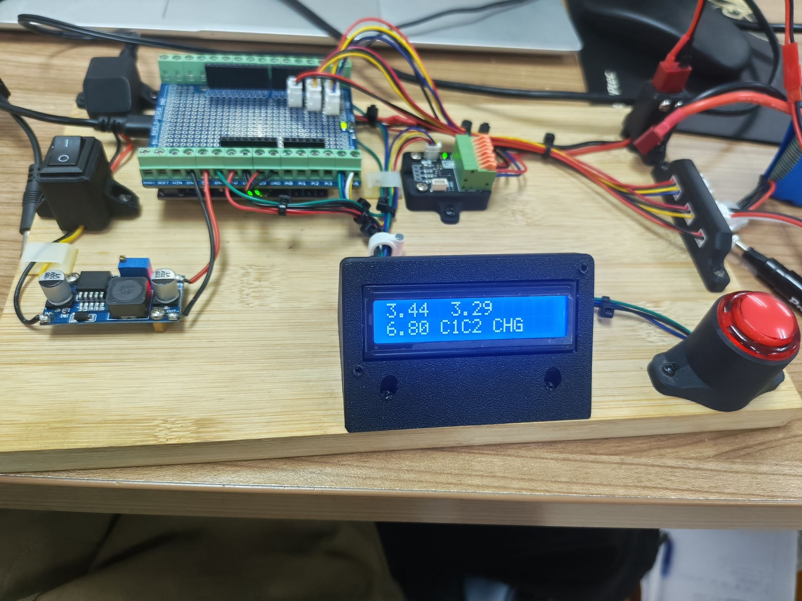

**Figure 8.** Example of the 2S CHG screen.

Example 3S CHG screen:

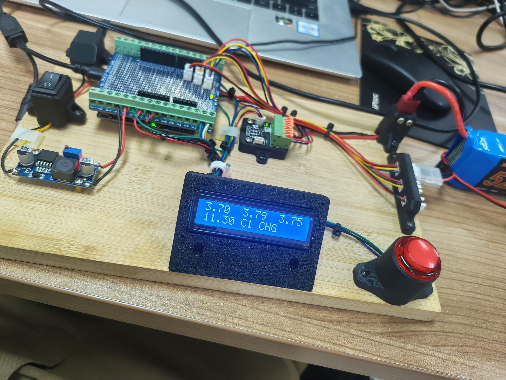

**Figure 9.** Example of the 3S CHG screen.

---

# Battery Removal Detection

The tester includes automatic battery removal detection.

After a test is completed, the result screen remains displayed while the battery is connected.

When the battery is removed, the tester automatically returns to the ready screen for the selected battery type.

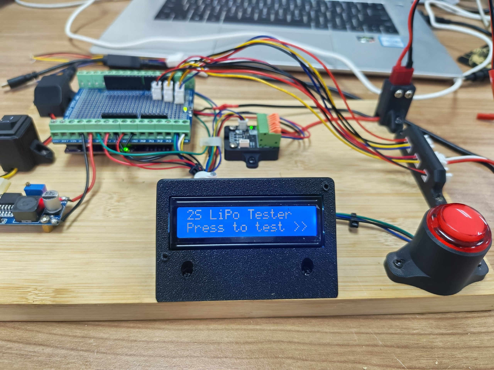

**Figure 10.** Ready screen after battery removal.

---

# Button Operation

The button has different functions depending on the current screen.

## Battery Selection Screen

Short press:

`1S → 2S → 3S`

Long press:

Confirm the selected battery type.

## Ready Screen

Short press:

Start the battery test.

Long press:

Return to battery selection.

## Result Screen

Short press:

No action.

Long press:

Return to battery selection.

Battery removal:

Automatically return to the ready screen.

---

# Buzzer Operation

The onboard Maker UNO buzzer is connected to:

`D8`

The buzzer is used to indicate the test result.

PASS:

`1 beep`

FAIL:

`3 beeps`

The buzzer provides an audible indication in addition to the LCD and LED status.

---

# LED Status

The external LED is connected to:

`D4`

The LED indicates the current test result.

PASS:

`LED ON`

FAIL:

`LED blinking`

The LED and buzzer provide a quick visual and audible indication of the battery condition.

---

# LCD Result Examples

## 1S Battery

Example display:

`3.76`

`3.76 V  [PASS]`

The tester measures one cell and displays the cell voltage and final result.

---

## 2S Battery

Example display:

`3.56     3.76`

`7.45V  [FAIL]`

The two individual cell voltages are displayed on the first line and the total PACK voltage is displayed on the second line.

---

## 3S Battery

Example display:

`3.76  3.81  3.75`

`11.54V      [PASS]`

The three individual cell voltages are displayed on the first line and the PACK voltage and final result are displayed on the second line.

---

# Testing Results

The completed tester was tested with real LiPo batteries.

One of the successful 3S tests produced approximately:

| Measurement | Voltage |
|---|---:|
| Cell 1 | 3.84 V |
| Cell 2 | 3.85 V |
| Cell 3 | 3.77 V |
| PACK | 11.52 V |

The tester correctly identified the battery as:

`PASS`

Another 3S measurement produced approximately:

| Measurement | Voltage |
|---|---:|
| Cell 1 | 3.78 V |
| Cell 2 | 3.79 V |
| Cell 3 | 3.74 V |
| PACK | 11.31 V |

The tester also successfully tested 2S batteries and displayed individual cell voltages and total PACK voltage.

---

# Hardware Assembly Process

The complete hardware assembly was completed on a mounting board.

The assembly work included:

- Installing the Maker UNO
- Installing the TLA2528 ADC
- Soldering the button wires
- Soldering the voltage regulator wires
- Installing the dedicated ON/OFF power switch
- Connecting the main power circuit
- Adjusting the regulator output to 5V
- Verifying the 5V output
- Connecting the regulated 5V supply to the Maker UNO
- Mounting the Maker UNO and shield on the holder
- Preparing the LCD holder
- Mounting the LCD enclosure
- Preparing a dedicated PACK connector holder
- Organizing the battery connector wiring
- Connecting the ADC wiring
- Organizing the wiring using cable ties
- Completing the main physical assembly

The final assembly provides a compact and organized platform for testing LiPo batteries.

---

# Software

The tester was programmed using the Arduino IDE.

The main software functions include:

- TLA2528 ADC communication
- I2C communication
- LCD control
- Battery type selection
- Button short-press detection
- Button long-press detection
- Voltage measurement
- Voltage divider calculation
- Calibration
- Individual cell voltage calculation
- PACK voltage measurement
- PASS/FAIL evaluation
- LED control
- Buzzer control
- Battery removal detection
- Ready screen control
- Result screen control

The complete Arduino source code is available in the `code` folder.

**Complete Code:**

[LiPo_battery_tester.ino](./code/LiPo_battery_tester.ino)

---

# System Block Diagram

    LiPo Battery
          │
          ├──────────────► Voltage Divider ──► TLA2528 CH0
          │
          ├──────────────► Voltage Divider ──► TLA2528 CH1
          │
          ├──────────────► Voltage Divider ──► TLA2528 CH2
          │
          └──────────────► PACK Voltage Divider ──► TLA2528 CH3
                                                    │
                                                    │ I2C
                                                    ▼
                                             Cytron Maker UNO
                                                    │
                           ┌────────────────────────┼──────────────────────┐
                           │                        │                      │
                           ▼                        ▼                      ▼
                         LCD                    LED/Button              Buzzer
                      16x2 I2C                    D4 / D7                  D8

---

# System Operation

The complete system operates as follows:

    LiPo Battery
          │
          ▼
    Voltage Divider
          │
          ▼
    TLA2528 ADC
          │
          │ I2C
          ▼
    Cytron Maker UNO
          │
          ├────────► LCD Display
          │
          ├────────► LED
          │
          └────────► Buzzer

The battery voltage is first reduced using voltage divider circuits.

The TLA2528 measures the divided voltages.

The Maker UNO receives the ADC measurements through I2C and calculates the actual cell and PACK voltages.

The calculated values are displayed on the LCD.

The tester then evaluates the battery and provides a PASS or FAIL indication.

---

# Project Status

The LiPo Battery Tester hardware and software were successfully assembled, programmed, and tested.

The completed system successfully demonstrates:

- 1S battery testing
- 2S battery testing
- 3S battery testing
- Individual cell voltage measurement
- PACK voltage measurement
- LCD display
- Battery selection
- PASS/FAIL evaluation
- LED indication
- Buzzer indication
- Battery removal detection
- Short and long button control
- Complete physical hardware assembly

---

# Project Demonstration

A video demonstration of the completed LiPo Battery Tester is available below.

**Click the image to watch the demonstration on YouTube.**

---

# Author

**Adel Husham Mohamedain**

Electrical Engineering Student  
Universiti Malaysia Perlis (UniMAP)
